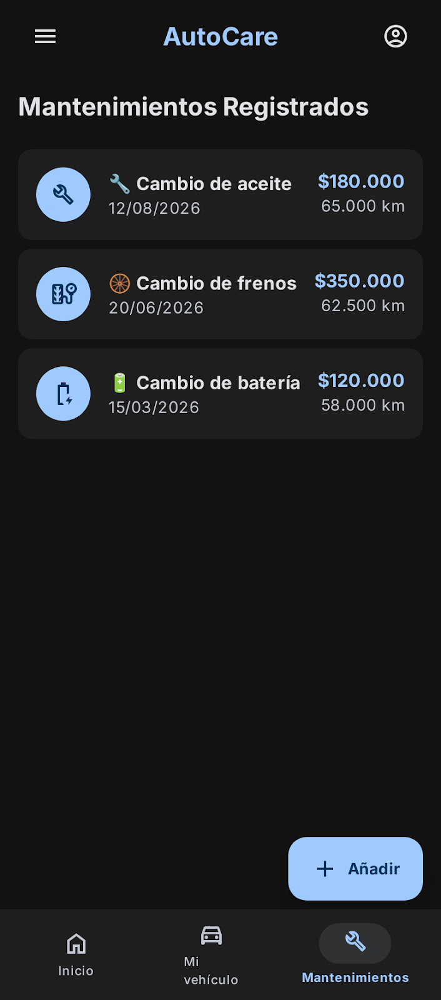
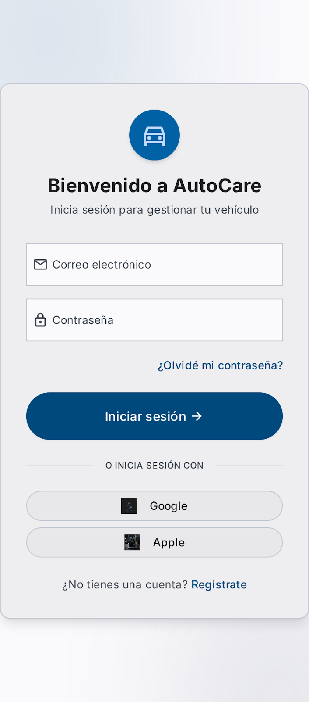
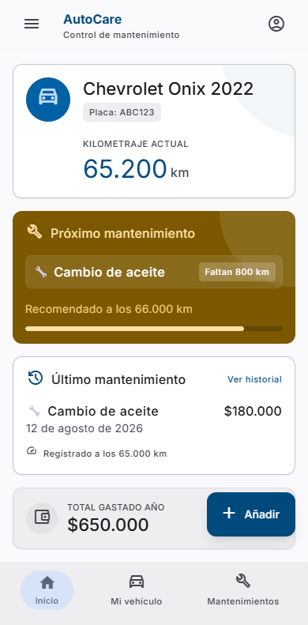
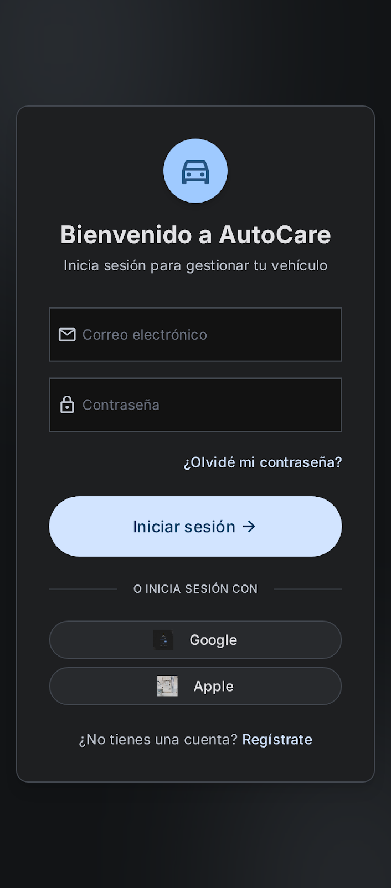
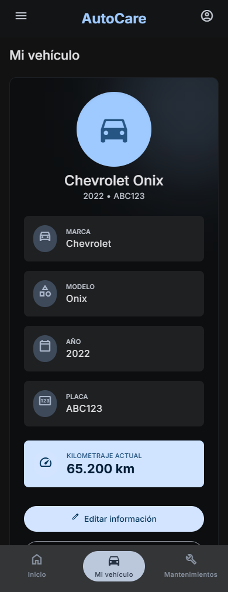
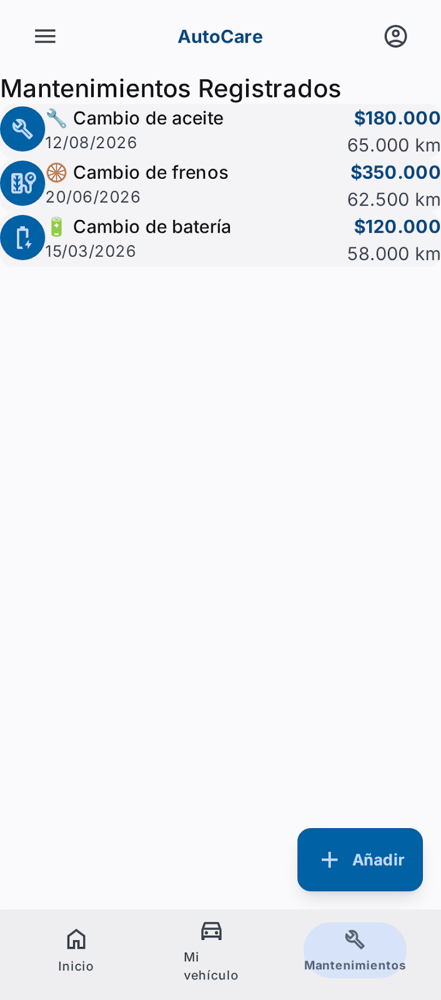
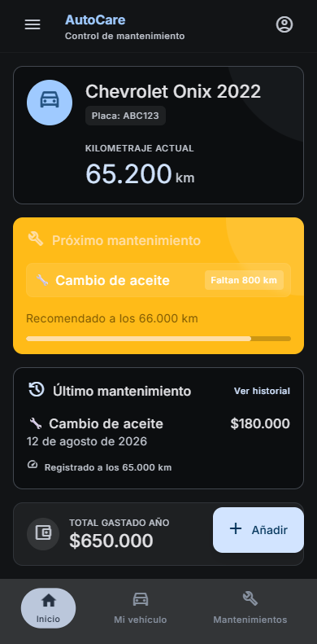
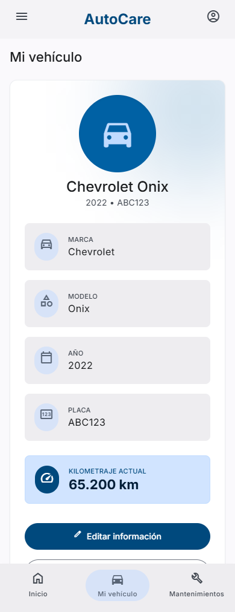

# Diseño de interfaz de usuario

La aplicación tendrá la siguientes pantallas

1. Pantalla 1: Inicio de sesión
   
   

2. Pantalla 2: Inicio / Dashboard
   
   

3. Pantalla 3: Mi vehículo
   
   

4. Pantalla 4: Mantenimientos registrados
   
   

# Referencias

- [Material Design: Foundations](...)
- [Material Design: Style](...)